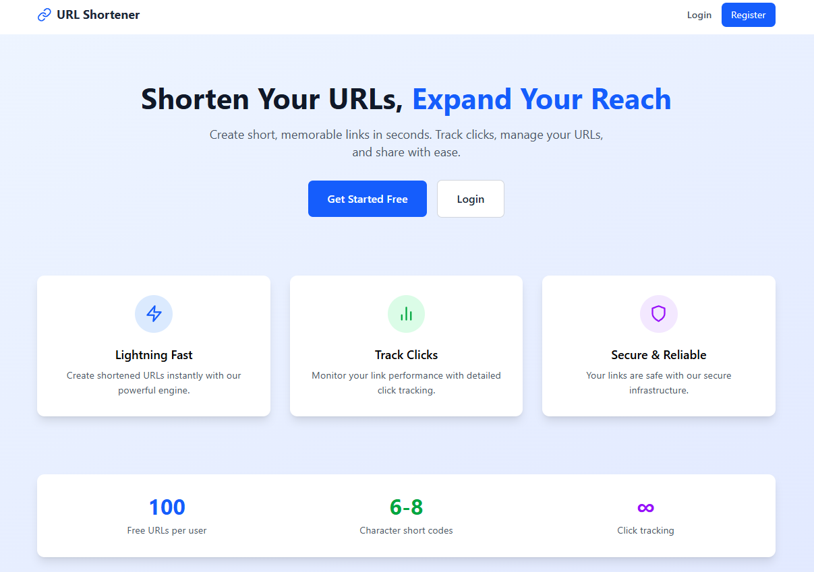
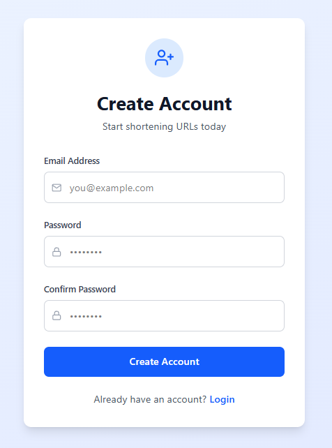
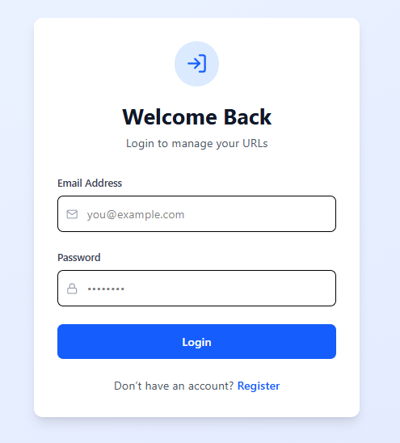
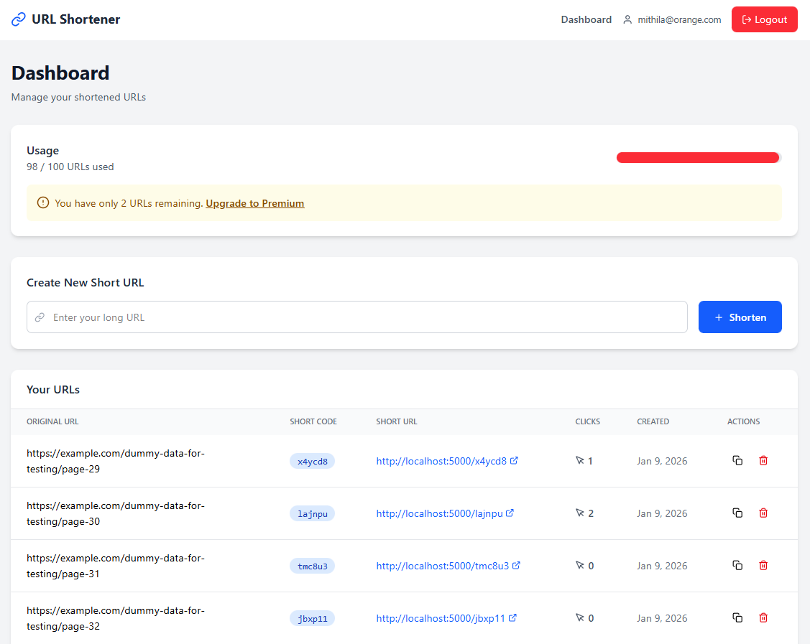

# 🚀 URL Shortener Project

A full-stack URL shortening application with authentication, built with React (Vite + Tailwind) for the frontend and Node.js + Express + MySQL for the backend.

## 🌟 Features

-   ✅ User registration and login (JWT-based authentication)
    
-   ✅ Authenticated users can shorten URLs
    
-   ⚠️ Maximum of 100 URLs per user (free tier)
    
-   ✅ View list of shortened URLs with stats:
    
    -   Clicks
        
    -   Created date
        
    -   Short URL
        
-   ✅ Delete URLs
    
-   ✅ Deleting a user automatically removes all their URLs
    
-   ✅ Responsive, mobile-friendly UI using Tailwind CSS
    

## 🧰 Tech Stack

### 🖥️ Frontend

-   React.js (v19.2.0)
    
-   Vite.js
    
-   Tailwind CSS
    
-   React Hook Form
    
-   Axios
    
-   React Router DOM
    
-   React Hot Toast
    
-   React Icons
    

### ⚙️ Backend

-   Node.js (v20+)
    
-   Express.js (v5.2.1)
    
-   MySQL2
    
-   JSON Web Tokens (JWT)
    
-   bcryptjs (password hashing)
    
-   express-validator (input validation)
    
-   nanoid (short URL generation)
    
-   dotenv (environment variables)
    
-   nodemon (dev only)
    

## 📦 Project Setup

### 1️⃣ Clone the Repository

`git clone https://github.com/RahatGithub/url-shortener.git` 

**Go to the project folder:**

`cd url-shortener`

### 2️⃣ Backend Setup

**Go to the backend folder:**

`cd backend`

**Install dependencies:**

`npm install`

Create a `.env` file in the `backend` folder (you can use `.env.example` as a template)

### 🗄 Database Setup

You can create the database and tables using the provided `db_schema.sql` file.

**Option 1: Using a GUI tool (like XAMPP / phpMyAdmin)**

-   Simply import the `db_schema.sql` file. The database and tables will be created automatically.
    

**Option 2: Using the terminal / command line**

Open MySQL:
`mysql -u root` 

Create the database:
`CREATE DATABASE url_shortener; EXIT;` 

Import the schema:
`mysql -u root url_shortener < db_schema.sql`

> ✅ After this, the database and tables will be ready, but no data will exist yet.

### 🧪 Populating the Database with Dummy Data

To explore the application, populate the database with some dummy data using the `seed.js` script in the backend folder:

`cd backend node seed.js`

-   Each time you run `seed.js`, a **new user** will be created with:
    
    -   A random email (e.g., `mithila@orange.com`, `shawon@apple.com`)
        
    -   Password: `123456`
        
-   The **credentials of the newly created user** will be displayed in the console log for easy login.
    

### 🚀 Start Backend Server

`npm run dev`

The backend should now be running at:

`http://localhost:5000`

### 3️⃣ Frontend Setup

Go back the project root folder (url-shortener):

`cd ../`

Go to the frontend folder:

`cd frontend`

Install dependencies:

`npm install`

Start the frontend dev server:

`npm run dev`

The frontend should now be running at:

`http://localhost:5173`

## 📡 API Testing (Optional)

You can use Postman, Insomnia, or any REST client to test the backend APIs.

Base URL:

`http://localhost:5000/api`

### 🔐 Authentication

For protected routes, include the JWT token in the `Authorization` header:

`Authorization: Bearer <token>`

## 📚 API Endpoints

### 🔑 Auth Routes

| Method | Endpoint | Description | Auth Required |
| --- | --- | --- | --- |
| POST | `/auth/register` | Register a new user | ❌ No |
| POST | `/auth/login` | Login user | ❌ No |
| GET | `/auth/me` | Get current user info | ✅ Yes |

### 🔗 URL Routes

| Method | Endpoint | Description | Auth Required |
| --- | --- | --- | --- |
| POST | `/urls` | Create a short URL | ✅ Yes |
| GET | `/urls` | Get all user URLs | ✅ Yes |
| DELETE | `/urls/:id` | Delete a URL | ✅ Yes |
| GET | `/urls/:id` | Get URL stats | ✅ Yes |

### 🖼 Screenshots

### 🏠 Homepage

### 🔑 Register Page

### 🔐 Login Page

### 📊 Dashboard

## 🚀 Improvements / Future Scope

-   🔁 Use an ORM like Prisma or Sequelize instead of raw SQL for better scalability
    
-   🧾 Introduce TypeScript for improved type safety
    
-   💎 Implement a Premium subscription for unlimited URLs
    

## ℹ️ Notes

-   ⚠️ A maximum of 100 URLs per user is enforced; users cannot create more once the limit is reached (free tier).
    
-   🔐 Authentication is required for all main operations (except register, login, and possibly a public home page/redirect route).
    
-   🗑 Deleting a user will also automatically delete all their URLs from the database.